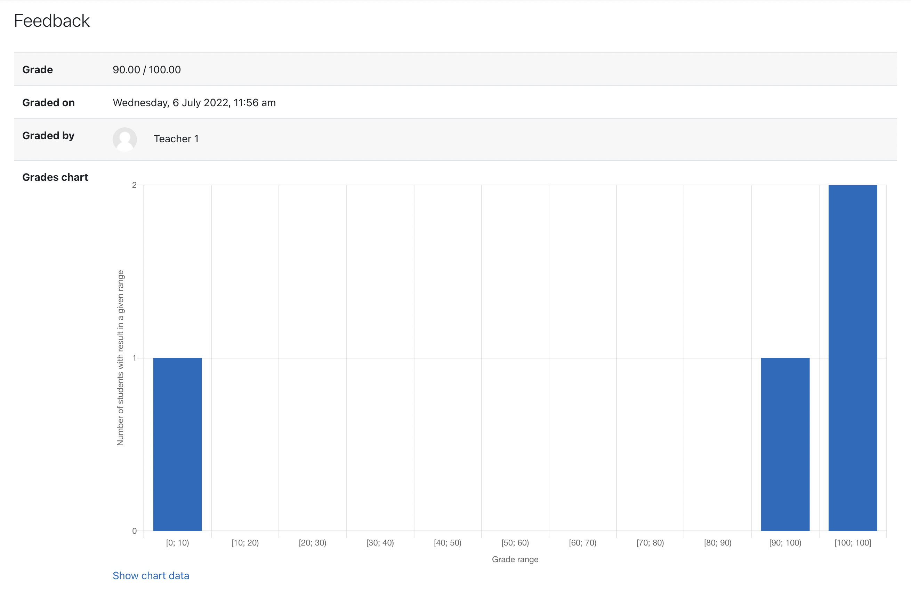

# Grades chart - Moodle assign feedback plugin

A simple Moodle assign feedback plugin,
allowing students to check how other students
handled a given task by presenting their grades on a chart.

Supported Moodle versions: 3.5, 3.6, 3.7, 3.8, 3.9, 3.10, 3.11, 4.0

## Quick install

Download zip package, extract to a folder and upload this folder
into `mod/assign/feedback` directory.

## Changelog

- Version 2022070900
  - Compatibility with Moodle 3.11
- Version 2022071000
  - Add missing `/classes/privacy/provider.php`
- Version 2022071200
  - Use `bcmath` library for all float calculations
- Version 2022071201
  - Fix coding style problems
- Version 2022071202
  - Fix coding style problems (again)
- Version 2022071300
  - Do not show charts in Grading table
  - Do not show chart when the grading type is not "Point"
  - Show chart when grading user submission
- Version 2022071900
  - Add github action support
  - Fix constant naming
  - Fix `MOODLE_INTERNAL` checks
  - Use `null_provider`
- Version 2022080600
  - Shorten `yasis_label` string
  - Add `self::` when referencing class constants
  - Compatibility with Moodle 4.0
- Version 2022082400
  - Compatibility with Moodle 3.5+

## About

Developed by: Kacper Rokicki <k.k.rokicki@gmail.com>

GIT: https://github.com/k-rokicki/moodle-assignfeedback_grades_chart
